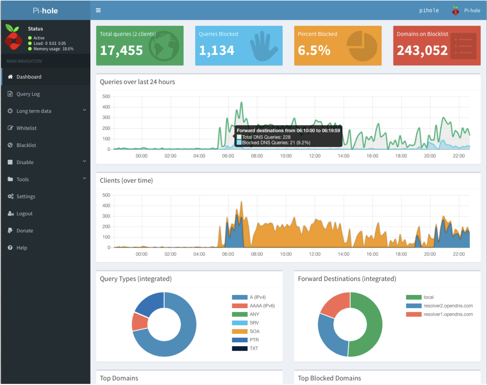

# DNS

## Introduction
Here is a link that discribe what is DNS, How it works and the components of the DNS.
https://www.cloudflare.com/learning/dns/what-is-dns/

## Security Issue with DNS

https://www.sans.org/reading-room/whitepapers/dns/security-issues-dns-1069

## Setup DNS Server on Raspberry Pi

https://pi-hole.net

Use pi-hole as DNS Sever

Basically pi-hole is a DNS server with Web interface, which is easy to use.

In pi-hole, we can maintain the whitelist and blacklist for every domain. The main function in pihole is ad-blocking. There is a thing call gravity that maintian list of domain which is used for Ad. Pi-hole use this thing to block the domain so that the ad would be blocked.
Also pi-hole can show the query from each user using this server.